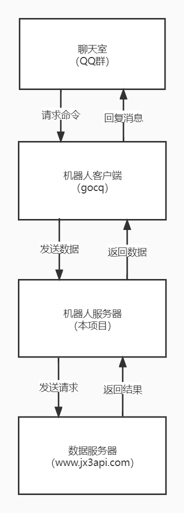

<div align="center">

# mini_jx3_bot

_✨基于[nonebot2](https://github.com/nonebot/nonebot2)的剑网三群聊机器人，采用[jx3api](https://jx3api.com)作为数据源。✨_

</div>

<p align="center">
<a href="https://www.python.org/">
</a>
<a href="https://github.com/nonebot/nonebot2">
</a>
<a href="https://github.com/Mrs4s/go-cqhttp">
</a>
</p>


## 这是什么
一个使用gocq作为协议端的QQ群聊机器人，可以接受处理QQ消息并回复，接入了[www.jx3api.com](https://www.jx3api.com)的数据后，可以查询《剑网三》内的游戏数据。

## 工作流程



## 简介
基于nonebot2的剑网三的QQ群聊机器人，采用jx3api为数据接口，提供剑网三的一些查询，娱乐功能。

- 跨平台使用
- 提供www.jx3api.com的事件封装
- 使用sqlite数据库，轻量便携
- 全异步处理，效率高效

## 更新说明
此库用于更简易的机器人管理，只能单gocq链接，请不要链接多个gocq客户端。

## 声明
本项目数据来源：[jx3api.com](https://www.jx3api.com)

## 部署机器人
### 安装环境
**项目需要python环境，且需要[python3.9+](https://www.python.org/downloads/)。**
```
apt-get install python3.9
```
**QQ协议端采用[go-cqhttp](https://github.com/Mrs4s/go-cqhttp)。**

- go-cqhttp需要下载ffmpeg环境，否则无法发送语音消息，具体安装请参考[文档](https://docs.go-cqhttp.org/guide/quick_start.html#%E5%AE%89%E8%A3%85-ffmpeg)。
### 安装依赖
```
pip install -r requirements.txt
```
### 安装playwright
页面截图需要采用playwright，第一次启动需要安装，可以参考[文档](https://playwright.dev/python/docs/intro)。
```
playwright install
```
### 配置设置
#### config.yml
```
# 数据站设置
jx3api:
  # ws链接地址
  ws_path: wss://socket.nicemoe.cn
  # ws的token授权，关联ws服务器推送消息类型
  ws_token: ~
  # 主站地址
  jx3_url:  https://www.jx3api.com
  # 主站token，不填将不能访问带ticket的接口
  jx3_token: ~

剩余部分自行参考填写
```
**使用腾讯云API进行闲聊操作，如果没有将使用[青云客API](http://api.qingyunke.com/)返回聊天**
- 申请地址：[点击申请](https://console.cloud.tencent.com/cam/capi) NLP自然语言处理：[点击申请](https://console.cloud.tencent.com/nlp)

- 申请成功后，获取访问密钥流程请参考[这里](https://cloud.tencent.com/document/product/598/45511)

**阿里云API进行语音合成，如果没有将不会发送语音信息。**
- appkey和access申请地址：[点击申请](https://nls-portal.console.aliyun.com/overview)

- 获取secret地址：[点击这里](https://usercenter.console.aliyun.com/)
#### .env.pord
```
nickname=["团子"] # 这里设置机器人的昵称
superusers=["你的QQ"] # 这里设置超级管理员QQ
```
### 启动
```
# 请在bot目录下

nb run
```
### 日志
**日志保存路径在：/log/，分为3个等级：ERROR，INFO，DEBUG，日志默认保存10天，以日期命名。**

## 功能列表
### 通用功能
|**插件**|**命令** |**说明**|
| :----: | :----: | :----: |
|自动插话|-|机器人会自动插话，可以修改活跃度|
签到|签到|简单的签到系统|
|智能闲聊|@机器人+XXX|默认使用腾讯API，辅助青云客API|
|查询功能|参考“帮助”|提供查询消息接口，接口使用jx3api|
|天气查询|XX天气/天气XX|查询天气，数据使用和风天气|
|疫情查询|XX疫情/疫情 XX|查询疫情情况|

### 查询功能(部分需要网站token)
|**功能**|**命令**|**说明**|
| :----: | :----: | :----: |
|骚话|骚话|返回一条剑网三骚话|
|日常查询|日常 [服务器]|查询服务器当天日常，服务器可省略|
|开服查询|开服 [服务器]|查询服务器开服情况，服务器可省略|
|更新公告|更新/公告/更新公告|查看最新更新公告|
|金价查询|金价 [服务器]|查询服务器金价，服务器可省略|
|前置查询|前置/条件 [奇遇名]|查询奇遇的前置条件和奖励|
|奇遇查询|查询 [服务器] [角色名]|查询角色奇遇记录，服务器可省略|
|奇遇列表|奇遇 [服务器] [奇遇名]|查询服务器的某个奇遇记录，服务器可省略|
|奇遇汇总|汇总 [服务器]|查询服务器的奇遇记录，服务器可省略|
|配装查询|配装 [职业]|查询职业配装，如“配装 冰心”或“冰心配装”|
|奇穴查询|奇穴 [职业]|查询职业奇穴，如“奇穴 冰心”或“冰心奇穴”|
|小药查询|小药 [职业]|查询职业小药，如“小药 冰心”或“冰心小药”|
|宏查询|宏 [职业]|查询职业的宏，如“宏 冰心”或“冰心宏”|
|物价查询|物价 [外观]|查询外观的物价|
|攻略查询|攻略 [宠物]/[宠物]攻略|查询宠物攻略|
|角色属性|装备/属性 [服务器] [角色]|查询角色的装备属性，服务器可省略|
|战绩查询|战绩 [服务器] [角色]|查询名剑大会战绩，服务器可省略|

### 管理功能
**管理功能需要群管理，或者超级用户才能使用**
|**功能**|**命令**|**说明**|
| :----: | :----: | :----: |
|绑定服务器|绑定 [服务器名]|更换群绑定的服务器|
|插件开关|打开/关闭 [插件名]|开关某一个插件|
|活跃值|活跃值 [1-99]|设置机器人活跃值|
|通知开关|打开/关闭 XX通知/XX推送|可以开关菜单内通知和ws的推送消息|
|通知内容|XX通知 [消息内容]|设置XX通知内容，晚安/进群/离群通知|
|滴滴|滴滴 [消息内容]|发送消息给机器人管理员。|

**机器人管理员私聊机器人可以管理机器人**
|**指令**|**说明**|
| :----: | :----: |
|帮助|获取管理帮助|
|好友列表|查看机器人好友列表|
|删除好友 [QQ号]|删除该好友|
|群列表|查看bot的群列表|
|打开/关闭 [群号]|远程打开/关闭群机器人开关|
|退群 [群号]|让bot退出该群|
|广播 [QQ群号] [消息]|给指定群发送一条广播消息|
|全体广播 [消息]|给所有打开机器人的群发送一条广播消息|
